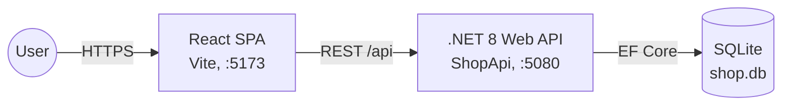
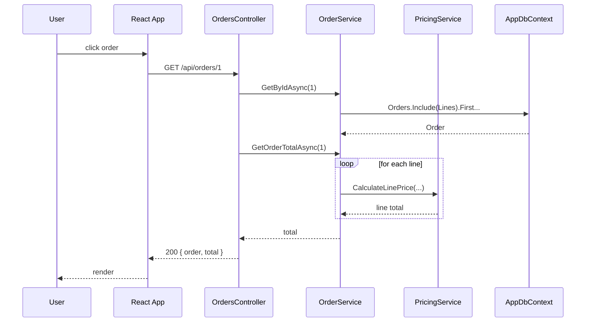
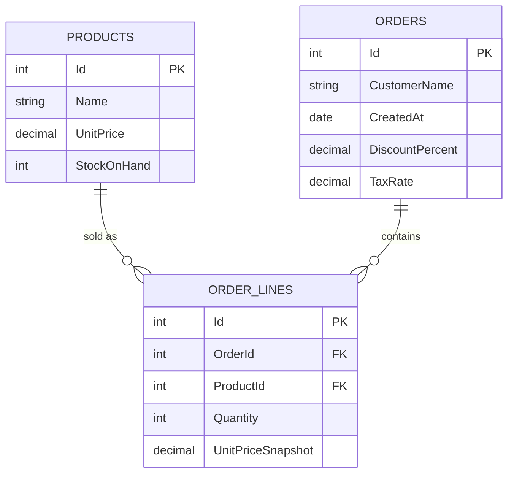

# Architecture Diagrams

Use these as the **starting point** for Segment 5 (Mermaid round-trip).
Open the Markdown preview in VS Code to render.

---

## 1. Container view (current state)

---

## 2. Sequence — GET /api/orders/{id}

---

## 3. ER diagram

---

## Exercise — round-trip

**Step A — Code → Diagram.**
Ask Copilot to regenerate diagram #2 after you add a `StockService.Reserve` call inside `OrderService.CreateAsync`.

**Step B — Diagram → Code.**
Edit diagram #1 to add a `Redis[(Redis cache)]` node between `API` and `DB`.
Then ask Copilot for the minimal code-change plan (see prompt #7 in [PROMPTS.md](../PROMPTS.md)).
